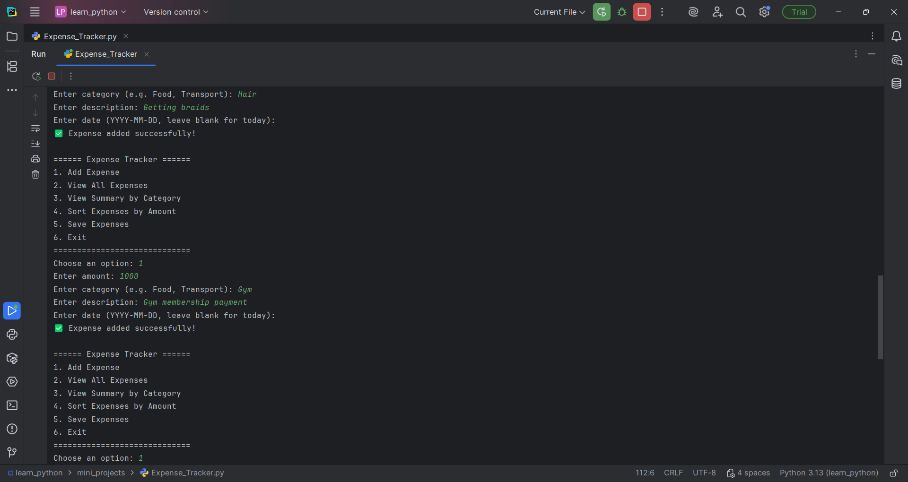
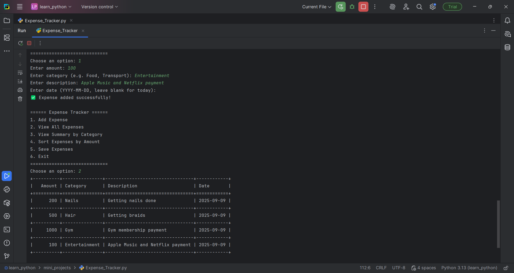
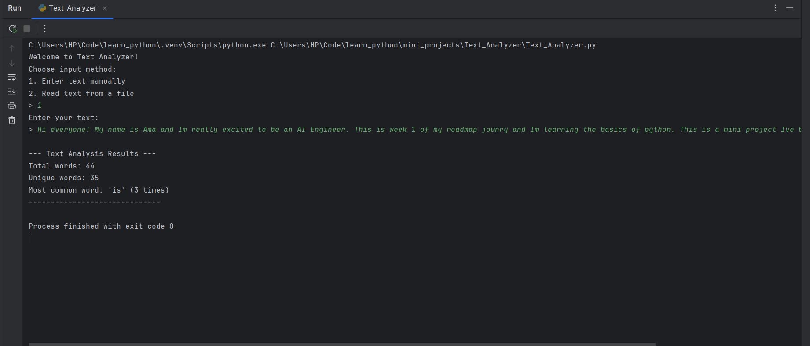
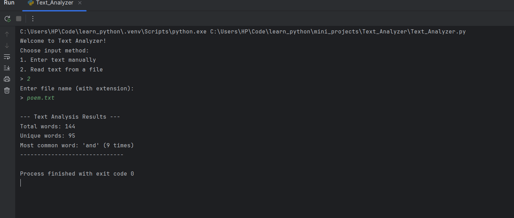
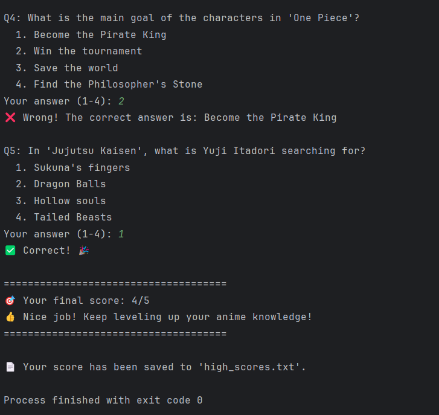

# 🐍 Python Basics Mini Projects 🎉

Welcome to my **Python Basics Mini Projects** repository! 🎉  

This repo is part of my **AI Engineer Roadmap Week 1**, where I focused on **strengthening my Python fundamentals**. Here, I built **three beginner-friendly projects** that helped me practice variables, data structures, loops, functions, file handling, exception handling, and classes — all while making something tangible and useful! 🚀

---

## 🌟 Project 1: Expense Tracker 💰

**Goal:** Practice Python basics by creating a simple personal finance tracker.

**Topics Covered:**  
- Variables, Numbers, Strings 🔢  
- Lists, Dictionaries 🗂  
- Loops & Conditionals 🔄  
- Functions & Classes 🏗  
- File Handling & CSV 💾  
- Exception Handling ⚠️  

**Features:**  
- Add, view, and save expenses  
- View summary by category  📊 
- Sort expenses by amount  

** Example Output:**  
<p align="center">
  
  
</p>

**Why it’s cool:**  
This project helped me combine **data storage**, **user input**, and **object-oriented programming** in a single tool. It also reinforced how to handle errors gracefully, which is key for any real-world app.

---

## 🌟 Project 2: Text Analyzer 📝

**Goal:** Analyze text data to practice **strings, dictionaries, loops, and classes**.

**Topics Covered:**  
- Strings & Lists 📝  
- Dictionaries for counting 🔢  
- Loops & Conditionals 🔄  
- Functions & Classes 🏗  
- File Handling & Exception Handling 💾⚠️  

**Features:**  
- Count total words  
- Count unique words  
- Find the most common word  🔍 
- Input text manually or via a file  

**Example Output:**  
<p align="center">
  
  
</p>

**Why it’s cool:**  
This project taught me how to **process and clean text**, a skill I’ll use in **NLP projects** later in my AI roadmap.  

---

## 🌟 Project 3: Mini Anime Quiz 🎮

**Goal:** Make a **fun quiz game** to practice Python basics interactively.

**Topics Covered:**  
- Loops & Conditionals 🔄  
- Lists & Dictionaries 🗂  
- Functions & Classes 🏗  
- Exception Handling ⚠️  
- Time delays for effects ⏱   

**Features:**  
- 5-question anime quiz ❓  
- Input validation & scoring 🏆  
- High score saving 💾  

**Example Output:**  
<p align="center">
  
  
</p>

**Why it’s cool:**  
It shows how Python can be **fun and interactive**, while reinforcing the basics of **classes, loops, and user input handling**.

---

## 🛠️ How to Run the Projects

1. Clone this repo:  
   ```bash
   git clone https://github.com/MissBaduwa/Python-Basics-Mini-Projects.git

2. Navigate into the project folder:  
   ```bash
   cd Python-Basics-Mini-Projects/Expense_Tacker

3. Run the Python script: 
   ```bash
   python main.py

Repeat for the other projects by entering their respective folders.

---
## 💡 What I Learned from Python Basics Tutorials

- Strengthened Python fundamentals
- Built small, useful, and interactive projects
- Learned how to organize code into classes and functions
- Practiced file handling and exception management (They arent as scary as I thought.)
- Coding small projects really helped the concepts stick. Exercises alone aren’t enough.
- Classes and functions make life way easier once you get them.
- Even simple projects can be fun and useful, and it feels good to have something tangible at the end of the week.

These projects form the foundation for my AI journey, preparing me for when I’ll start exploring data analysis and visualization.

---
## ✨ Connect With Me
I’m sharing my journey publicly on my [LinkedIn page](linkedin.com/in/ama-baduwa-baidoo-567059253)  to track learning, stay accountable, and inspire others.
Follow my roadmap to watch the journey unfold from Python basics → AI engineering!

 💡 Inspired by [Codebasics's AI Engineering Roadmap](https://github.com/codebasics) 
